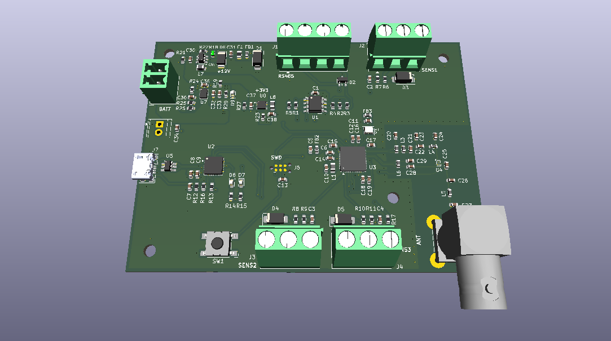

# STM32WL LoRaWAN Sensor Node

Low-power LoRaWAN sensor node based on the **STM32WL55**, originally designed as a prototype platform for distributed water-monitoring applications.

The original goal was not to build a complete water-quality instrument around a fixed set of probes, but to validate the **overall sensing and communication architecture** first: a battery-powered node, generic sensor interfaces, LoRaWAN connectivity, a local gateway and a self-hosted backend.

Water monitoring may involve very different sensors and analog front-ends depending on the quantity being measured. For this reason, the sensing layer is intentionally kept generic while the project focuses on validating the reusable parts of the system.



## Concept

The prototype is intended as a test platform for the complete data path:

```text
Sensor / External AFE
        |
   Analog / RS-485
        |
        v
   STM32WL55 Node
        |
      LoRaWAN
        |
        v
   Dragino Gateway
        |
        v
    ChirpStack
        |
       MQTT
        |
        v
   Backend / Web UI
```

The custom node provides a small set of generic interfaces:

- 3× protected and filtered analog inputs
- RS-485 interface
- Switchable 12 V sensor supply
- STM32WL55 integrated Sub-GHz radio
- USB-UART debug interface
- Battery-powered / low-power operation

Sensor-specific amplification, isolation or signal conditioning can be added externally when required.

This allows the LoRaWAN architecture, power-management strategy and backend to be developed independently from the final choice of water-quality sensors.

## Firmware

The firmware is being developed around a low-power, event-driven architecture with:

- periodic sensor acquisition
- timer-triggered ADC sampling with DMA
- digital filtering / processing
- asynchronous UART / RS-485 communication
- sensor power sequencing and warm-up
- deep-sleep and periodic wake-up
- periodic LoRaWAN uplinks
- UART debug console
- error handling and watchdog supervision

Typical measurement cycle:

```text
Sleep -> Sensor ON -> Warm-up -> Acquire -> Process
      -> Sensor OFF -> LoRaWAN TX (if scheduled) -> Sleep
```

Firmware development and LoRaWAN validation are currently performed using an **STM32WL55 development board**. The custom PCB has been designed but has not yet been fabricated.

Synthetic sensor values can be injected during development to validate payload generation and the complete communication path without depending on the final sensing hardware.

## LoRaWAN Infrastructure

A second goal of the project is to make the LoRaWAN test environment **reproducible and easy to deploy**, instead of relying on a manually configured development machine.

The planned local infrastructure consists of:

- Dragino LoRaWAN gateway
- ChirpStack network server
- Mosquitto MQTT broker
- containerized deployment with Docker Compose
- deployment / provisioning scripts
- Python / FastAPI backend for receiving, storing and visualizing measurements

The intended workflow is:

```text
docker compose up
        |
        v
ChirpStack + MQTT services
        |
        v
Automated provisioning
        |
        v
Gateway / device registration
        |
        v
End-to-end LoRaWAN test
```

Configuration files and scripts are kept in the repository so that the test environment can be recreated from a clean machine with minimal manual configuration.

The backend consumes application data exposed by ChirpStack through MQTT; the STM32 node itself only produces the application payload and remains independent from MQTT or the backend implementation.

## Repository Structure

```text
.
├── Hardware/          # KiCad schematic, PCB and documentation
├── Firmware/          # STM32WL55 firmware
├── Infrastructure/    # ChirpStack / MQTT / Docker deployment
├── Tools/             # Python utilities and provisioning tools
└── README.md
```

